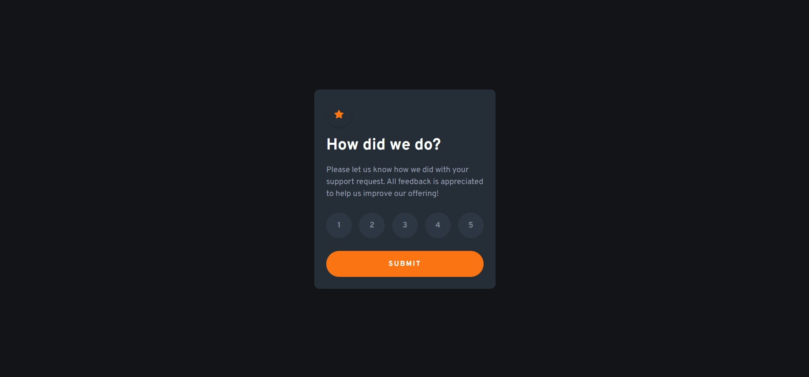
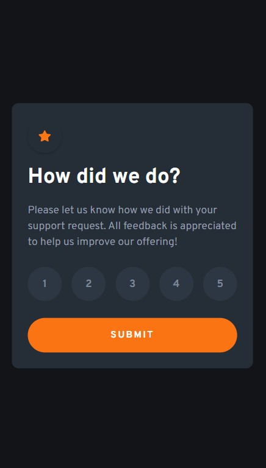

# Frontend Mentor - Interactive rating component solution

This is a solution to the [Interactive rating component challenge on Frontend Mentor](https://www.frontendmentor.io/challenges/interactive-rating-component-koxpeBUmI). Frontend Mentor challenges help you improve your coding skills by building realistic projects.

## Table of contents

- [Overview](#overview)
  - [The challenge](#the-challenge)
  - [Screenshot](#screenshot)
  - [Links](#links)
- [My process](#my-process)
  - [Built with](#built-with)
  - [Useful resources](#useful-resources)
- [Author](#author)

## Overview

### The challenge

Users should be able to:

- View the optimal layout for the app depending on their device's screen size
- See hover states for all interactive elements on the page
- Select and submit a number rating
- See the "Thank you" card state after submitting a rating

### Screenshot

##### Desktop

##### Mobile

### Links

- Solution URL: [GitHub](https://github.com/rockingrohit9639/Frontend-Mentor-Challanges/tree/master/sites/interactive-rating-component-main)
- Live Site URL: [Github Pages](https://rockingrohit9639.github.io/Frontend-Mentor-Challanges/sites/interactive-rating-component-main/)

## My process

### Built with

- HTML5
- CSS
- Flexbox
- Mobile-first workflow

### Useful resources

- [MDN Web Docs for HTML](https://developer.mozilla.org/en-US/docs/Web/HTML) - This is a great documentation for learning HTML.
- [MDN Web Docs for CSS](https://developer.mozilla.org/en-US/docs/Web/CSS) - This is a great documentation for learning CSS.

## Author

- Website - [Rohit Kumar Saini](https://portfolio-45b9b.web.app/)
- Frontend Mentor - [@rockingrohit9639](https://www.frontendmentor.io/profile/rockingrohit9639)
- Twitter - [@\_rohit\_\_404](https://twitter.com/_rohit__404)
- LinkedIn - [Rohit Kumar Saini](https://www.linkedin.com/in/rohit-kumar-saini/)
