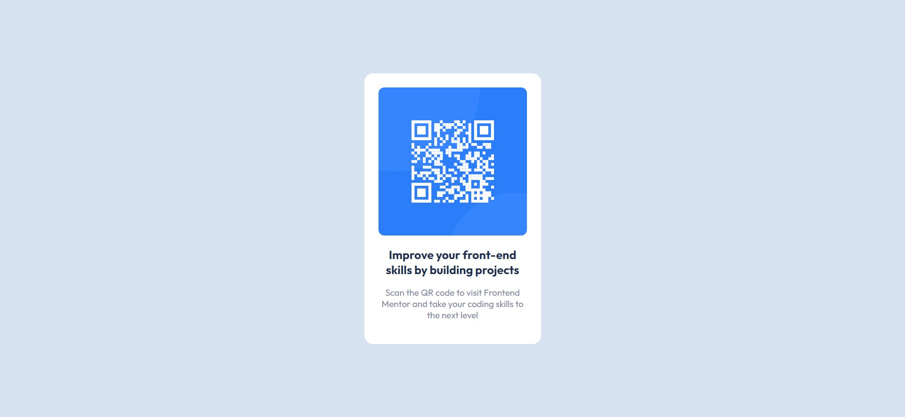

# Frontend Mentor - QR code component solution

This is a solution to the [QR code component challenge on Frontend Mentor](https://www.frontendmentor.io/challenges/qr-code-component-iux_sIO_H). Frontend Mentor challenges help you improve your coding skills by building realistic projects. 

## Table of contents

- [Overview](#overview)
  - [The challenge](#the-challenge)
  - [Screenshot](#screenshot)
  - [Links](#links)
- [My process](#my-process)
  - [Built with](#built-with)
  - [Useful resources](#useful-resources)
- [Author](#author)

## Overview

### Screenshot

##### Desktop

##### Mobile

### Links

- Solution URL: [GitHub](https://github.com/rockingrohit9639/NFT-preview-card-component)
- Live Site URL: [Github Pages](https://rockingrohit9639.github.io/NFT-preview-card-component/)

## My process

### Built with

- HTML
- CSS
- Flexbox

## Author

- Website - [Rohit Kumar Saini](https://portfolio-45b9b.web.app/)
- Frontend Mentor - [@rockingrohit9639](https://www.frontendmentor.io/profile/rockingrohit9639)
- Twitter - [@_rohit__404](https://twitter.com/_rohit__404)
- LinkedIn - [Rohit Kumar Saini](https://www.linkedin.com/in/rohit-kumar-saini/)
